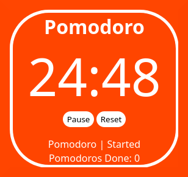
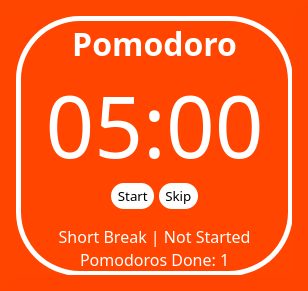

# pomodoro

A simple pomodoro timer.

## Usage

Open `index.html` in `pomodoro` folder.

## Screenshots

## More information

See [Pomodoro Technique](https://en.wikipedia.org/wiki/Pomodoro_Technique) page on Wikipedia.